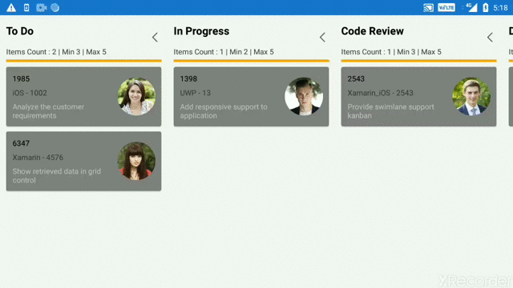

# How to edit Xamarin.Forms Kanban card details in dynamically
This article explains how to edit the Kanban cards in [Syncfusion Xamarin.Forms SfKanban](https://help.syncfusion.com/xamarin/kanban-board/getting-started).

Let us have the use case to show popup while tapping the desired card and that popup contains the field to edit all necessary information once done our editing, it should be updated in the corresponding cards. 

To achieve this, generate the initial Kanban view by populating the [ItemsSource](https://help.syncfusion.com/xamarin/kanban-board/getting-started) and populating that data to the custom cards using [CardTemplate](https://help.syncfusion.com/cr/xamarin/Syncfusion.SfKanban.XForms.SfKanban.html#Syncfusion_SfKanban_XForms_SfKanban_CardTemplate) property with corresponding category as per in below code snippet.

[XAML]
```
<ContentPage.Resources>
        <ResourceDictionary>
            <DataTemplate x:Key="dataTemplate">
                <StackLayout BackgroundColor="Gray">
                    <Grid ColumnSpacing="0" HorizontalOptions="FillAndExpand" Padding="10" >
                        <Grid.ColumnDefinitions>
                            <ColumnDefinition Width="*" />
                            <ColumnDefinition Width="80" />
                        </Grid.ColumnDefinitions>

                        <StackLayout Grid.Column="0"  Orientation="Vertical" >
                            <Label FontSize="Small" Text="{Binding Path=ID}" TextColor="Black"/>
                            <Label Text="{Binding Path=Title}" />
                            <Label FontSize="Small" Text="{Binding Path=Description}" WidthRequest="150" TextColor="Silver" LineBreakMode="WordWrap" />
                        </StackLayout>

                        <StackLayout Grid.Column="1" >
                            <Image WidthRequest="60" HeightRequest="60" HorizontalOptions="End" VerticalOptions="CenterAndExpand" Source="{Binding Path=ImageURL}"></Image>
                        </StackLayout>
                    </Grid>
                </StackLayout>
            </DataTemplate>
          </ResourceDictionary>
    </ContentPage.Resources>

    <StackLayout>

        <kanban:SfKanban x:Name="kanban" 
                    ItemsSource="{Binding Cards}"
                    AutoGenerateColumns="True"
                    HorizontalOptions="FillAndExpand"
                    VerticalOptions="FillAndExpand"
                    CardTemplate="{StaticResource dataTemplate}"
                    ItemTapped="Kanban_ItemTapped"
                    WidthRequest="400"
                    HeightRequest="600">

            <kanban:SfKanban.Columns>
                <kanban:KanbanColumn x:Name="todoColumn" Title="To Do" MinimumLimit="3" MaximumLimit="5">
                </kanban:KanbanColumn>

                <kanban:KanbanColumn x:Name="progressColumn" Title="In Progress" MinimumLimit="2" MaximumLimit="5">
                </kanban:KanbanColumn>

                <kanban:KanbanColumn x:Name="codeColumn" Title="Code Review" MinimumLimit="3" MaximumLimit="5">
                </kanban:KanbanColumn>

                <kanban:KanbanColumn x:Name="doneColumn" Title="Done" MinimumLimit="2" MaximumLimit="6">
                </kanban:KanbanColumn>

            </kanban:SfKanban.Columns>
        </kanban:SfKanban>

    </StackLayout>
```
Define the categories of column using Categories property of Kanban Column and cards will be added to the respective columns.

[C#]

```
public MainPage()
        {
            InitializeComponent();
            todoColumn.Categories = new List<object>() { "Open" };
            progressColumn.Categories = new List<object>() { "In Progress" };
            codeColumn.Categories = new List<object>() { "Code Review" };
            doneColumn.Categories = new List<object>() { "Done" };
        }
```

On Kanban’s ItemTapped event, show the popup with desired model and it will be binding with view which contains the necessary field to edit the details once “Ok” button clicked, it will update the model to view the changes in card.

[C#]
```
private void Kanban_ItemTapped(object sender, KanbanTappedEventArgs e)
        {
            var data = viewModel;
            ShowPopup((data as CustomViewModel), (e.Data as CustomModel));
        }

        private void ShowPopup(CustomViewModel viewModeldata, CustomModel modelData)
        {
            var editPage = new PopUp();
            Navigation.PushModalAsync(editPage);
            editPage.comboBox.SelectionChanged += (textSender, eventArgs) =>
            {
                if ((viewModeldata as CustomViewModel).Cards.Contains(modelData as CustomModel))
                {
                    (modelData as CustomModel).Category = editPage.comboBox.SelectedItem;
                }
                kanban.ItemsSource = null;
                kanban.ItemsSource = viewModel.Cards;
            };
            editPage.editor.Completed += (textSender, eventArgs) =>
            {
                if ((viewModeldata as CustomViewModel).Cards.Contains(modelData as CustomModel))
                {;
                    
                    (modelData as CustomModel).Description = editPage.editor.Text;
                }
            };
        }
```
Create the popup page to edit the kanban cards to be modified and changes to be reflected in UI.

[C#] PopUp.cs 
```
public class PopUp : ContentPage
    {
        public Editor editor;

        public SfComboBox comboBox;
        public PopUp()
        {
            this.BackgroundColor = Color.Transparent;
            this.WidthRequest = 200;
            this.HeightRequest = 100;

            var layout = new StackLayout();
            layout.Padding = new Thickness(50, 100);
            layout.BackgroundColor = Color.Silver;
            layout.Orientation = StackOrientation.Vertical;
            layout.HorizontalOptions = LayoutOptions.Center;
            layout.VerticalOptions = LayoutOptions.Center;

            var label = new Label();
            label.Text = "Enter Description:";
            label.FontSize = 14;
            label.TextColor = Color.Black;
            label.VerticalOptions = LayoutOptions.Center;

            editor = new Editor();
            editor.TextColor = Color.Black;
            editor.VerticalOptions = LayoutOptions.Center;

            var label2 = new Label();
            label2.Text = "select the Category:";
            label2.FontSize = 14;
            label2.TextColor = Color.Black;
            label2.VerticalOptions = LayoutOptions.Center;
            layout.Children.Add(label2);

            List<String> countryNames = new List<String>();
            countryNames.Add("Open");
            countryNames.Add("In Progress");
            countryNames.Add("Code Review");
            countryNames.Add("Done");

            comboBox = new SfComboBox();
            comboBox.HeightRequest = 40;
            comboBox.BackgroundColor = Color.AliceBlue;
            comboBox.ComboBoxSource = countryNames;
            layout.Children.Add(comboBox);

            var button = new Button();
            button.Text = "OK";
            button.BackgroundColor = Color.Blue;
            button.VerticalOptions = LayoutOptions.Center;
            button.Clicked += Button_Clicked;

            layout.Children.Add(label);
            layout.Children.Add(editor);
            layout.Children.Add(button);

            Content = layout;
        }
        private void Button_Clicked(object sender, EventArgs e)
        {
             Navigation.PopModalAsync();
        }
    }
```

 


## See Also

[How to customize the Kanban boards column](https://help.syncfusion.com/xamarin/kanban-board/column)

[How to customize the Kanban boards cards](https://help.syncfusion.com/xamarin/kanban-board/cards)

[How to initialize Kanban getting started](https://help.syncfusion.com/xamarin/kanban-board/getting-started#initialize-kanban)
